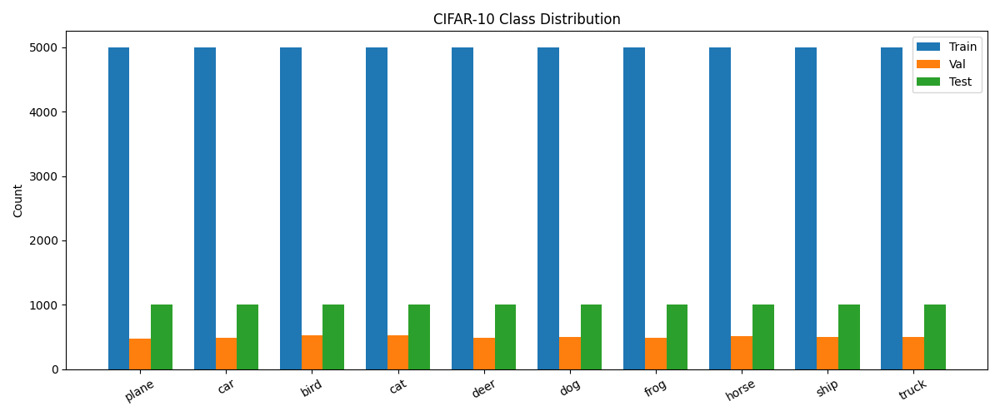
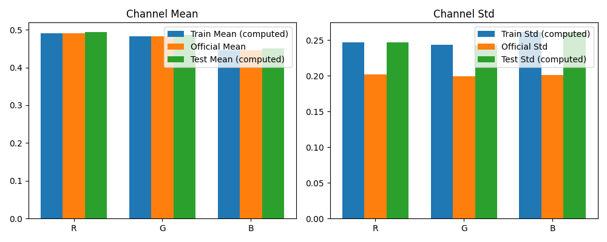

# CIFAR-10 图像分类技术报告

日期：2025-12-24

## 1. 问题定义
- **任务**：使用 PyTorch 在 CIFAR-10 数据集（10 类，RGB，3×32×32）上进行图像分类。
- **模型对比**：
  - 基础模型：LeNet 风格（两卷积 + 两全连接）
  - 进阶模型：LeNet + BatchNorm + 训练集数据增强
  - 主模型：简化版 VGG-style CNN（3×3 卷积堆叠 + BN + 模块化 + 池化）
- **目标**：在统一训练配置下，对比三种模型的收敛速度、泛化能力与最终指标。

## 2. 数据处理
- **数据集**：CIFAR-10 官方划分（训练 50,000，测试 10,000）。
- **预处理（三模型一致）**：
  - 归一化到 `[0,1]`：`ToTensor()`
  - 标准化：通道均值与标准差 $
    \mu=(0.4914,0.4822,0.4465),\ \sigma=(0.2023,0.1994,0.2010)$
- **数据增强（仅训练集，LeNet 进阶与 VGG）**：
  - `RandomCrop(32, padding=4)`
  - `RandomHorizontalFlip()`
- **验证集划分策略**：
  - 从训练集 50,000 中按比例劈分 10% 作为验证集：
    $$ N_{\text{train}}=45{,}000,\ N_{\text{val}}=5{,}000,\ N_{\text{test}}=10{,}000 $$
  - 证明思路：固定测试集 10,000（官方），对剩余 50,000 进行 $90\%/10\%$ 划分，可兼顾训练充分性与验证稳健性。
- **类别分布可视化**：
  - 使用分析脚本统计各类样本数并绘制柱状图（训练/验证/测试）。
  - 运行：`python analysis/data_analysis.py`，将生成如下图片：
    - `reports/img/class_distribution.png`
    - `reports/img/channel_stats.png`
  - 可视化示例：
    
    
    
    

## 3. 模型架构（图文）
- **LeNet（基础）**：
  - 卷积模块：`Conv(3→6, 5×5)` → `ReLU` → `MaxPool(2×2)` → `Conv(6→16, 5×5)` → `ReLU` → `MaxPool(2×2)`
  - 全连接：`Linear(16×5×5→120)` → `ReLU` → `Linear(120→10)`
  - 可视化：
    - Netron：`model_visualizations/lenet.onnx`
    - Torchviz：`model_visualizations/lenet_torchviz.png`
    - Torchinfo：`model_visualizations/lenet_torchinfo.txt`
- **LeNet Advanced（进阶）**：
  - 每个卷积层后加入 BN：`Conv` → `BatchNorm` → `ReLU` → `MaxPool`
  - 其他结构与基础版保持一致。
  - 可视化：
    - Netron：`model_visualizations/lenet_advanced.onnx`
    - Torchviz：`model_visualizations/lenet_advanced_torchviz.png`
    - Torchinfo：`model_visualizations/lenet_advanced_torchinfo.txt`
- **Simple VGG（主模型）**：
  - Block1（输入 3×32×32）：`[Conv3×3→BN→ReLU]×2` → `MaxPool(2×2)`（输出 32×16×16）
  - Block2：`[Conv3×3→BN→ReLU]×2` → `MaxPool(2×2)`（输出 64×8×8）
  - Block3：`[Conv3×3→BN→ReLU]×2` → `MaxPool(2×2)`（输出 128×4×4）
  - 分类器：`Linear(128×4×4→512)` → `ReLU` → `Dropout(0.5)` → `Linear(512→10)`
  - 可视化：
    - Netron：`model_visualizations/simple_vgg.onnx`
    - Torchviz：`model_visualizations/simple_vgg_torchviz.png`
    - Torchinfo：`model_visualizations/simple_vgg_torchinfo.txt`


## 4. 训练配置
- **统一超参数**：

| 参数 | 值 |
|---|---|
| Batch Size | 64（并行训练可调整 `BATCH_SIZE` 环境变量） |
| Optimizer | Adam |
| Learning Rate | 0.001 |
| Epochs | 10 |
| Loss | CrossEntropyLoss |
| AMP | 开启（`autocast`+`GradScaler`） |
| cuDNN | `torch.backends.cudnn.benchmark=True` |
| DataLoader | `pin_memory=True`，Windows 并行默认 `num_workers=0`（可用 `NUM_WORKERS_PER_PROC` 调整） |

- **早停策略**：
  - 监控指标：`val_acc` 或 `val_loss`
  - 触发条件：若连续 `patience=5` 个 epoch 未提升，则提前停止训练。
  - 最优模型保存：启用 `ModelCheckpoint`（保存 `best.pth`），避免过拟合回退。

  当前代码未启用早停；如需启用，可在训练循环中加入 `best_metric` 与 `patience` 逻辑并保存最优模型。

## 5. 评估结果
- **曲线（按模型）**：
  - LeNet：`cifar10_lenet/outputs/lenet_curves.png`
  - LeNet Advanced：`cifar10_lenet_advanced/outputs/lenet_advanced_curves.png`
  - Simple VGG：`cifar10_vgg_simple/outputs/simple_vgg_curves.png`
  - 曲线包含：训练损失/测试损失、训练准确率/测试准确率（若引入验证集，建议将测试曲线替换为验证曲线）。
- **测试集指标（示例表结构）**：

| 模型 | Top-1 Acc (%) | Loss | 说明 |
|---|---:|---:|---|
| LeNet | （训练后填充） | （训练后填充） | 无数据增强 |
| LeNet Advanced | （训练后填充） | （训练后填充） | 训练集增强 + BN |
| Simple VGG | 82.53% | （训练后填充） | 3×3 堆叠 + BN |

- **混淆矩阵/类别准确率（可选）**：可补充按类指标与混淆矩阵，以观察类别不平衡与误分类模式。

## 附录
- **生成可视化与曲线**：
```powershell
# 训练并生成曲线（各项目）
python cifar10_lenet/main.py
python cifar10_lenet_advanced/main.py
python cifar10_vgg_simple/main.py

# 或并行训练（资源占用较高）
python train_all.py

# 导出模型计算图（ONNX/TensorBoard/Torchinfo/Torchviz）
python visualize_models.py
```
- **环境与依赖**：见根目录 `requirements.txt` 与 `environment.yml`。
 - **数据分析脚本**：已提供 `analysis/data_analysis.py`，运行后会在 `reports/img/` 下生成类别分布与通道统计图。
